# Comment faire un jeu en MonoGame

# Présentation
Bonjour, je m'appelle **Mohammad**, j'ai 18 ans. Je suis au *CFPT Informatique* en première année. Je suis un grand passionné de la programmation, mais mes passions sont le sport et la programmation.

# Cours
Ce cours est sur C# MonoGame.

## Quel est l'objectif de ce cours ?
Le but de ce cours est qu'à la fin, vous serez capable de créer un mini-jeu en MonoGame.
# Le sommaire
1. Installation de MonoGame  
2. Créer un projet  
3. La structure  
4. Créer un rectangle  
5. Animer le rectangle  
6. Le clavier et la souris  
7. Afficher une image  
8. Afficher du texte  
9. Jouer un son  
10. Finir le programme
11. Conclusion  

# Installation
## Installer l'extension MonoGame  
Premièrement, il faut avoir Visual Studio Code. Si vous n'avez pas Visual Studio Code, regardez le tutoriel ci-dessous pour savoir comment l'installer. Et n'oubliez pas d'installer **C#**.  
Tutoriel pour installer Visual Studio 2022 : [Installer Visual Studio](https://www.youtube.com/watch?v=SViilF85ues)

Quand vous avez Visual Studio, ouvrez-le et, sur la page d'accueil, allez sur "Ouvrir sans code" :  
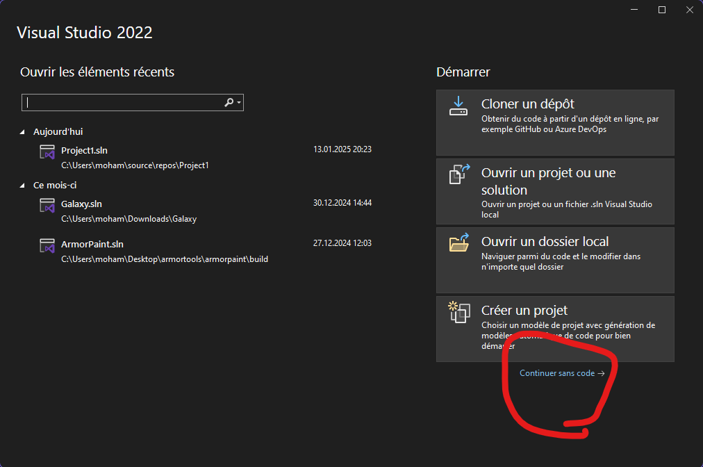

Ensuite, une fois à l'intérieur, cliquez sur "Extensions" et "Gérer les extensions" :  
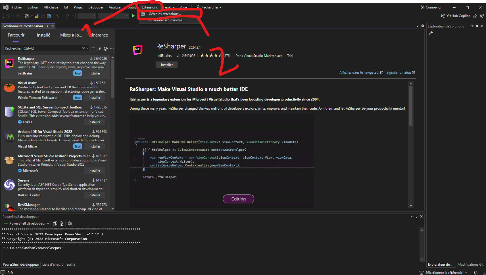

Ensuite, tapez dans la barre de recherche "MonoGame". Puis, cliquez sur la première extension et installez-la.  
**Normalement, vous devez fermer Visual Studio après avoir cliqué sur le bouton Installer** :  
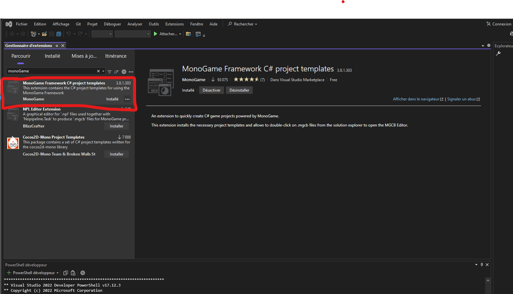

## Installer .NET 6  
Vous devez installer .NET 6, car MonoGame supporte mal les autres versions de .NET.  

Ouvrez Visual Studio Installer, puis cliquez sur "Modifier" pour la version de Visual Studio que vous utilisez (pour moi, ce sera Visual Studio 2022).  

Pour la première étape, n'oubliez pas, si vous ne l'avez pas encore fait, d'activer le **Développement .NET Desktop**, car c'est très important. Ensuite, cliquez tout en haut, dans le menu de navigation horizontal, sur **Composants Individuels** :  
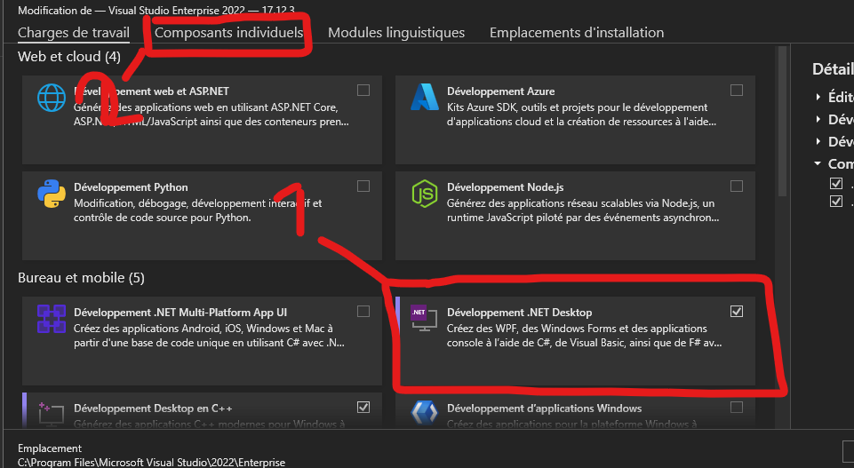

Dans la barre de recherche, tapez ".NET 6", puis activez tous les composants qui contiennent .NET 6.  
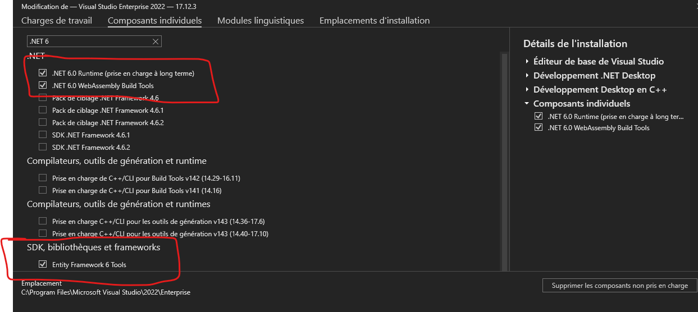

Enfin, cliquez sur "Installer" ou "Modifier" en bas à droite.  

# Créer un projet *MonoGame*

1. **Ouvrir Visual Studio**  
   Lancez Visual Studio, cliquez sur **Créer un projet**, puis dans la barre de recherche, tapez `MonoGame`. Ensuite, sélectionnez **MonoGame Cross-Platform** :  
   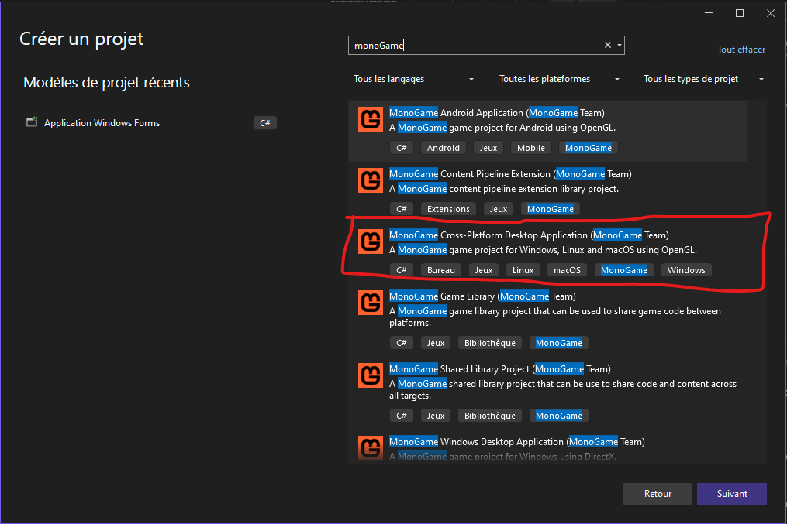

2. **Configurer le projet**  
   Cliquez sur **Suivant**.  
   Donnez un nom à votre projet (choisissez un nom significatif) et enregistrez-le dans un emplacement facile à retrouver plus tard.

3. **Lancer le projet**  
   Une fois le projet créé, appuyez sur le bouton **Run** comme illustré ci-dessous :  
   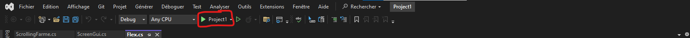

4. **Vérification**  
   Si une fenêtre bleue s'affiche, cela signifie que vous avez réussi à configurer et lancer votre projet avec succès.

# Structuré votre projet

1. **Comprondre la sctructure de monoGame**
    Pour commencer ouvrez le script Game1.cs 
    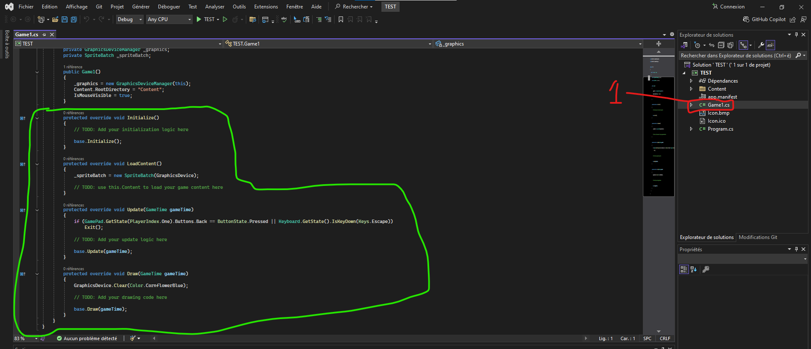
    Comme nous pouvons voir ici nous avon  4 functions *Initzialize* , *LoadContent* , *Update* et *Draw*
    * Chaque function est tres utiles. Je vais vous expliquez chaque function
    * Vous trouverai toutes ces function un peu pres dans chaque projet de jeu video mais cela depent aussi de l'environnement mais en tout cas pour monoGame ca sera comme ca .
2. **Initialize**:
    Quand la class Game sera invoquer les premier variable atre inizialisez ce sont les variable qui sont initializer dans le constructeur et puis la function *Initialize* sera invoqué.
    Et cette function ne pren pas d'argument en paramettre.
3. **LoadContent**
    Apres avoir *Initializer* , les variables qui doivent  etre inizializer et on besoin d'un chargement comme les 
    *"**Textures** , **Fonts** , **Sons**"*  *LoadContent*.
    Pour info cette function ne prend pas d'argument et ne return rien.
4. **Update**
    Ici c'est le **Moteur** du jeux c'est ici que vous allez mettre tout les logique qui dpive etre executer a chaque fois c'est une sort de boucle.Qui donne la vie a votre jeux .
    Il y a un argument gameTime qui est une classe qui donne le temp depuis quele jeux est active et dautre proprieté que vous pourvez voir dans le docs.
5. **Draw**
    *Draw* c'est une function qui va dessiner chaque Object qui doit etre afficher sur l'ecran.
## **Orienté Objet**
1.    **Definition:** *La programmation orientée objet (POO) est une façon d'écrire du code où tout tourne autour d'objets. Un objet, c'est une sorte de "boîte" qui contient des données (appelées propriétés) et des actions (appelées méthodes).*
2. **Exemple:** *La programmation orientée objet, c'est comme créer des "jouets" dans un jeu. Chaque jouet a des caractéristiques (comme une voiture qui a une couleur ou une vitesse) et peut faire des choses (comme avancer ou klaxonner). Tu fabriques ces jouets en suivant un modèle qu'on appelle une classe.*
3. **L'héritage** : L'héritage, c'est comme dire : "Un chien est un animal."
Tu as une classe parent (Animal) qui décrit des choses communes, comme marcher ou respirer. Puis, tu crées une classe enfant (Chien) qui reprend tout ça, mais tu peux ajouter des trucs spécifiques, comme aboyer. C'est une façon de réutiliser et d'ajouter des détails sans tout refaire.
4. **polymorphisme:** le polymorphisme, c’est comme quand une même action peut se faire de différentes façons selon la situation.
Par exemple, tu as une classe Animal avec une action parler(). Si c’est un Chien, parler() fera "aboyer". Si c’est un Chat, parler() fera "miauler". Tous les animaux savent "parler", mais chacun le fait à sa manière !

### Game1
Comme nous pouvons voir il'y a la class Game1 dane limage que je vous est montrer la classe Game1 herite de la classe game on peut le voir (*Game1 : Game*)

# Créer un rectangle  
Pour créer un rectangle, c'est très simple. Vous devez déclarer en global dans la classe *Game1* comme ceci :  
**`private Texture2D texture`**;  
`private Rectangle rectangle;` 
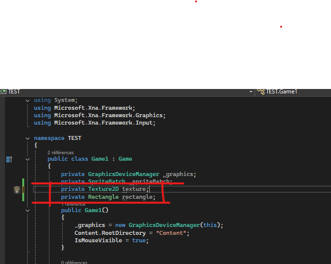  

Puis, comme je vous l'ai dit, nous devons charger la texture (nous allons mettre une couleur, c'est cela la texture). Comme expliqué avant, la texture doit être initialisée dans **LoadContent**, et le rectangle dans **Initialize**. Ensuite, nous allons commencer un `Draw` puis dessiner notre objet comme ceci :  
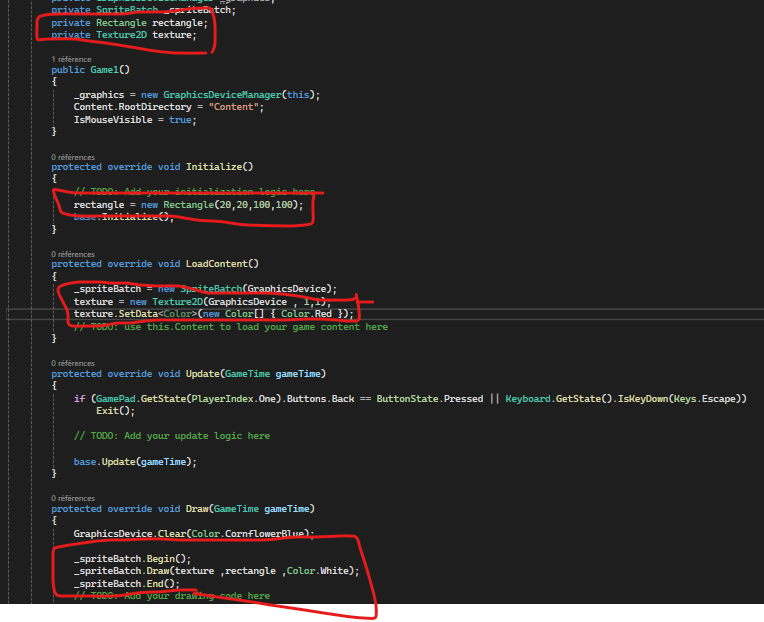  

Pour le rectangle, il prend les arguments `x`, `y`, `largeur` et `hauteur`. La texture, elle, utilise la classe `GraphicsDevice` pour sa taille en `x` et `y`.  

Pour le `Draw`, on commence par démarrer un dessin, on dessine, et à la fin, on pousse tout. La fonction `Draw` prend beaucoup d'arguments, mais pour un simple rectangle, trois suffisent : **la texture**, **le rectangle**, et **sa couleur**.  

## Qu'est-ce que sont ces classes **GraphicsDeviceManager** et **SpriteBatch** ?  
1. La classe **GraphicsDeviceManager** : Elle configure l'écran, la carte graphique ou encore la résolution. En fait, elle gère les paramètres de la carte graphique.  
2. La classe **SpriteBatch** : Elle effectue le rendu graphique, tout ce qui concerne le dessin et l'affichage.

# Animer le rectangle  
Ici, nous allons déplacer un rectangle d'un point A à un point B.  
Pour commencer, nous allons beaucoup travailler avec `Update`.  

Déclarez deux variables : la vitesse (*float speed*) et la position cible (*Vector2 PositionB*).  
Initialisez-les comme ceci :  
``float speed = 2f;  
Vector2 PositionB = new Vector2(400, 200);  

Vector2 Direction = Vector2.Normalize(PositionB - rectangle.Location.ToVector2());  
float distance = Math.Abs((rectangle.Location.ToVector2() - PositionB).Length());  

if (distance >= 2)  
    rectangle.Location += (Direction * speed).ToPoint();``  

Voici à quoi doit ressembler votre code : 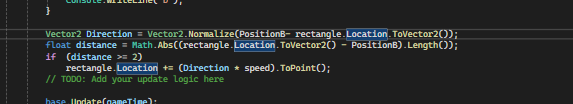  

# Le clavier et la souris  
Déclarez dans la classe Game1 deux variables :  
``private KeyboardState keyboardState;  
private MouseState mouseState;``  

Puis, dans la méthode Update, initialisez-les comme ceci :  
``keyboardState = Keyboard.GetState();  
mouseState = Mouse.GetState();``  

Si vous voulez vérifier qu'une touche est appuyée, vous devez utiliser une condition avec :  
``keyboardState.IsKeyDown(Keys.LaTouche)``  
Et pour savoir si elle est relâchée :  
``keyboardState.IsKeyUp(Keys.LaTouche)``  

Voici un exemple :  
`
if (keyboardState.IsKeyDown(Keys.W))  
{  
    Console.WriteLine("W");  
}
`

Pour la souris, pour détecter un clic :  
``mouseState.Left/RightButton == ButtonState.Pressed``  
Et pour savoir si le bouton est relâché :  
``ButtonState.Released``  

Voici un exemple :  
`if (mouseState.LeftButton == ButtonState.Released)  
{  
    texture.SetData<Color>(new Color[] { RandomColor() });  
}`  

Nous allons tester tout cela :  
Pour commencer, déclarez une classe Random statique dans la classe Game1 comme ceci :  
``public static Random random = new Random();``  

Puis, créez une fonction RandomColor qui retourne une couleur aléatoire comme ceci :  
`private Color RandomColor()  
{  
    return new Color(random.Next(0, 256), random.Next(0, 256), random.Next(0, 256));  
}`  

Ensuite, modifiez la couleur du rectangle à chaque clic, comme ceci :  
`if (mouseState.LeftButton == ButtonState.Pressed)  
{  
    texture.SetData<Color>(new Color[] { RandomColor() });  
}`

Ici, `SetData` prend le type de données, ici *Color*, et l'argument **new Color[] { RandomColor() }**, qui est un tableau de taille fixe dans lequel nous insérons notre couleur. C'est similaire à une liste, mais avec une taille définie.  

Enfin, essayons de déplacer le rectangle avec le clavier. Voici comment faire :  
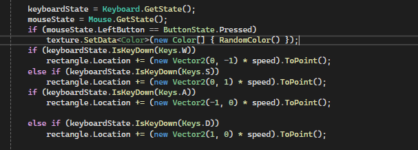  
# Afficher une image  
Pour commencer, nous devons importer l'image que l'on veut afficher.  

## Importer notre image  
Dans votre projet, ouvrez le dossier *Content* dans **l'Explorateur de solutions**.  
**Ouvrez le Content.mgcb dans le dossier Content** (double-cliquez dessus).  
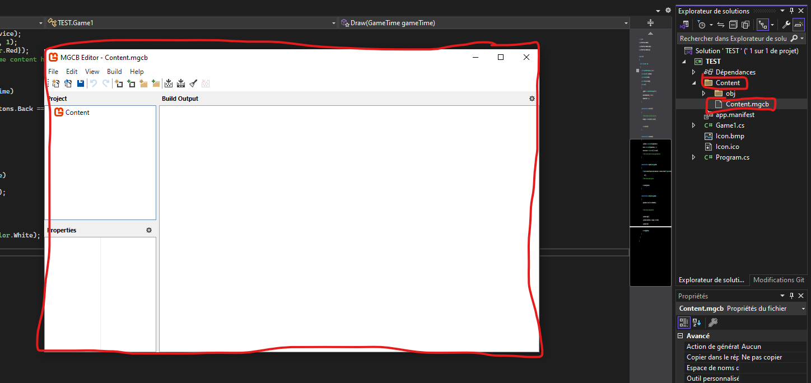  
Pour importer une image, cliquez sur ce que j'ai mis en rouge dans l'image.  
Pour ajouter un dossier, cliquez sur la zone entourée en bleu.  
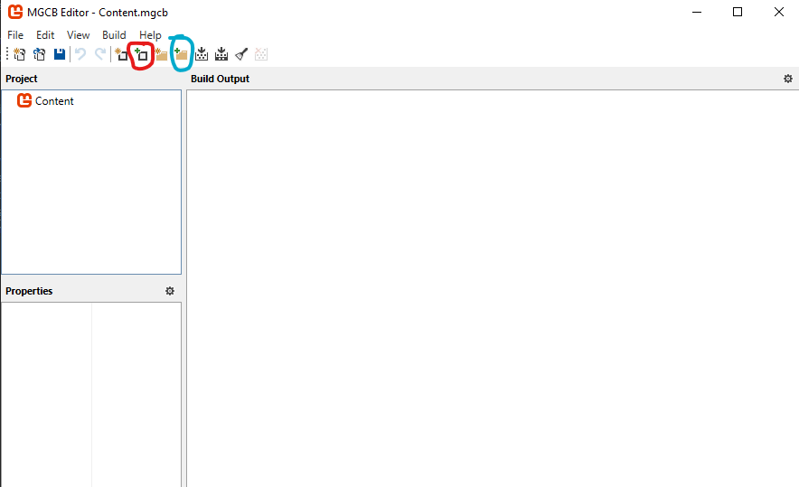  
Quand vous ouvrez votre image, faites comme ici :  
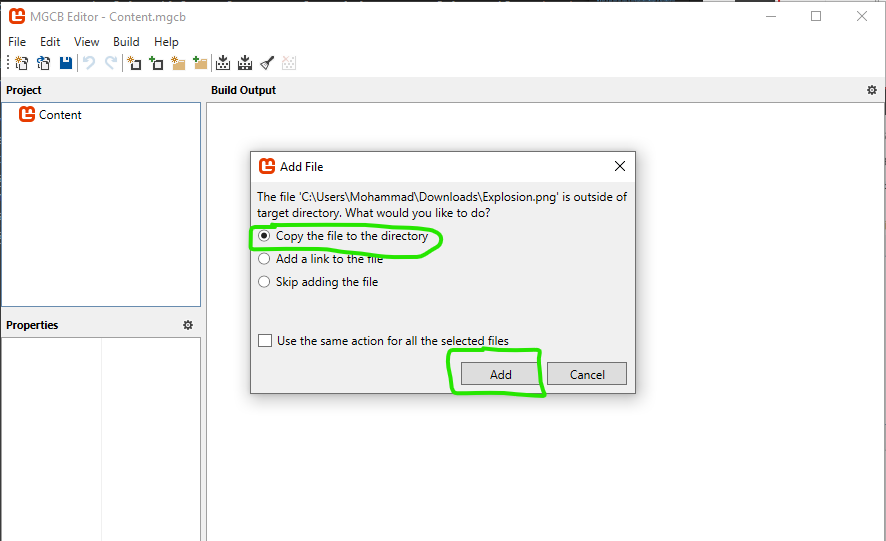  
**Ensuite, n'oubliez pas de cliquer sur Build**, sinon cela ne fonctionnera pas :  
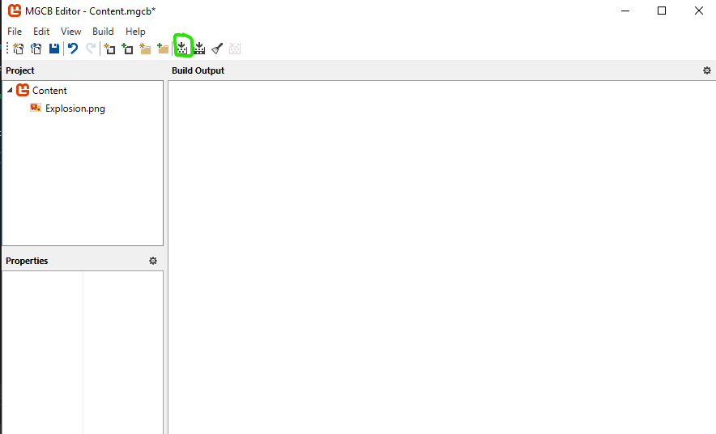  

## Afficher l'image  
Ajoutez une nouvelle texture dans la classe Game1 :  
``private Texture2D panier;``  
Ensuite, chargez l'image dans la fonction `LoadContent` :  
``panier = Content.Load<Texture2D>("panier");``  
Ici, nous chargeons l'image que nous avons importée dans *Content* et lui attribuons le type `Texture2D`. L'argument `"panier"` correspond au nom de votre fichier.  
Enfin, pour afficher la texture, il faut l'associer à un rectangle ou un autre sprite.  
Par exemple, dans la fonction *Draw* :  
``_spriteBatch.Draw(panier, rectangle, Color.White);``  

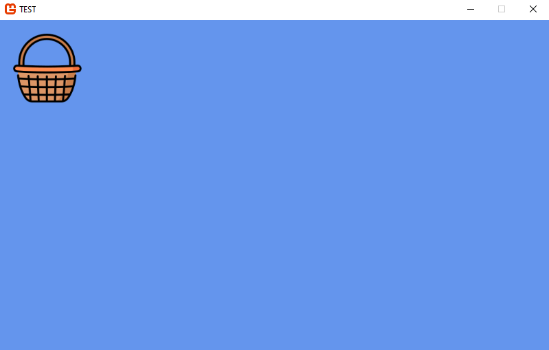  

# Afficher du texte

Pour commencer, nous devons importer une police (font).

## Comment importer une police

1. Téléchargez la police que vous souhaitez utiliser sur Internet. Personnellement, j'utilise [Google Fonts](https://fonts.google.com/).
2. Ensuite, installez la police. Faites un clic droit dessus, puis cliquez sur **Installer**.
3. Une fois la police installée, ouvrez votre projet, puis allez dans le fichier `Content.mgcb`.

## Dessiner du texte dans MonoGame

Pour afficher du texte, utilisez la méthode `DrawString` comme dans l'exemple ci-dessous :
`_spriteBatch.DrawString(font, "Point: " + panier.exp, new Vector2(100, 20), Color.DarkRed);`
Dans cet exemple :
- `font` est la police que vous avez importée.
- `"Point: " + panier.exp` est le texte à afficher (vous pouvez personnaliser cette partie).
- `new Vector2(100, 20)` représente la position où le texte sera affiché.
- `Color.DarkRed` est la couleur du texte.

Avec cette méthode, vous pouvez facilement afficher du texte dans votre jeu MonoGame.
# Jouer un son  
Pour importer un son, c'est exactement comme pour l'image. Vous allez tout d'abord créer une variable de type `Song` qui se nomme `song`, comme ceci :  
``private Song song;``  
Puis vous allez l'initialiser dans le `LoadContent`, comme ceci :  
``song = Content.Load<Song>("Sound/bom");``  

Ensuite, créez un autre dossier *modules*, puis un fichier *CS* qui se nomme **Audio.cs**.  
Ajoutez une fonction `public static` qui renvoie `void` et qui se nomme **PlaySound**.  
Dans cette fonction, nous allons vérifier s'il y a déjà une chanson en train d'être jouée. Si c'est le cas, nous allons arrêter la chanson. Ensuite, nous allons voir si la chanson donnée en paramètre n'est pas `null`. Si c'est le cas, nous allons jouer la chanson, comme ceci :  
``public static void PlaySound(Song song)  
{  
    if (MediaPlayer.State == MediaState.Playing)  
        MediaPlayer.Stop();  
    if (song != null)  
    {  
        MediaPlayer.Play(song);  
        MediaPlayer.IsRepeating = false;  
    }  
}``  

Puis, pour tester, allez à l'endroit où vous avez détecté le clic gauche, et jouez la chanson comme cela :  
``Audio.PlaySound(song);``  

# Finir le jeu  
Pour commencer, nous allons créer 3 fichiers C# : **"Fruit"**, **"GlobalI"**, **"Panier"**, comme ceci :  
  
## GlobalI  
Dans le fichier *GlobalI*, nous allons remplacer la classe par une **interface** ([voir le document](https://www.w3schools.com/cs/cs_interface.php)) comme ceci :  
. Comme ceci :
`
    public interface GlobalI
    {

            void Update();
            void Initialize();
            void Draw(SpriteBatch target);
            void LoadContent( ContentManager content,GraphicsDevice device);

    }
`
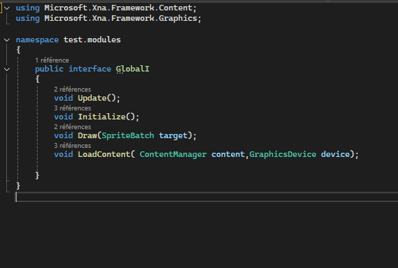

## Fruit  
Dans le fichier *Fruit*, nous allons commencer par créer un **enum** ([voir le document](https://www.w3schools.com/c/c_enums.php)) et le nommer `Fruits` comme ceci :      {
        Pomme,
        Banane,
        Orange,
        Fraise,
        Raisin
    }`
Ensuite, pour la classe *Fruit*, nous allons l'implémenter avec l'interface `GlobalI` comme ceci :  
`public class Fruit : GlobalI;`
### Variables  
Nous ajoutons les variables suivantes :
//Public

        public static  Random random = new Random();
        public readonly int exp = random.Next(20,50);
//private

        private Color color ;
        private readonly int speed = random.Next(1, 3);
        private Texture2D texture ;
        private Vector2 StartPosition;
        private Vector2 screenSize;
        private Rectangle rectangle;
        private List<Fruit>  parentList;`

- **exp** pour savoir combien d'expérience donnera le fruit ramassé (*readonly* indique que cette variable est constante).
- **StartPosition** pour déterminer la position de départ du fruit.
- **parentList** pour savoir dans quelle liste le fruit est stocké.
    

### Constructor
Le constructeur est une fonction appelée lors de l'initialisation des variables. Exemple: `   public Fruit(Vector2 screenSize , List<Fruit> parentList) {
       this.screenSize = screenSize;
       this.parentList = parentList;
}`
Du coup comme vous avez vu, nous n'avons pas besoin de mettre ce qu'il renvoie.
Voici le reste des fonctions : `

        public void Initialize() {
            StartPosition = new Vector2(random.Next(1, (int)screenSize.X) , -100);
            rectangle = new Rectangle((int)StartPosition.X , (int)StartPosition.Y ,50,50);
        }
        public void Update() {
            StartPosition += new Vector2(0,speed);
            rectangle.Location = StartPosition.ToPoint();
            if ((50+StartPosition.Y)>screenSize.Y)
            {
                parentList.Remove(this);
            }
        }
        public void Draw(SpriteBatch target) {
            target.Draw(texture, rectangle, Color.White);
        }
        public void LoadContent(ContentManager content, GraphicsDevice device) {
            string fruitName = ((Fruits)random.Next(0, 5)).ToString();
            texture= content.Load<Texture2D>( fruitName);
        }
        public Rectangle GetRectangle()
        {
            return rectangle;  
        }
`
## Panier
### Variables
`
       
        //Public
        public static Random random = new Random();
        //private
        private Color color;
        public  int exp = 0;
        private readonly int speed = random.Next(5, 10);
        private Texture2D texture;
        private Vector2 screenSize;
        private Rectangle rectangle;
        private KeyboardState keyboardState;
        private MouseState mouseState;
        private SpriteFont fontTest;
        private Song song;`
### Constructor
    `public Panier(Vector2 screenSize) { this.screenSize = screenSize; }`
### Methodes 
    ` public void CreateColision(List<Fruit> fruits)
     {
     foreach (var item in new List<Fruit>(fruits))
     {
         if (item == null) continue;
         if (rectangle.Contains(item.GetRectangle()))
         {
             fruits.Remove(item);
             Audio.PlaySound(song);
             exp += item.exp;
         }
     }
    }
`
La fonction *CreateColision* **(List<Fruit> fruits)** prend un argument List<Fruit> :
on va parcourir tous les fruits puis vérifier s'ils entrent en collision avec le panier.
Et supprimer le fruit dans la liste.

Et le reste des méthodes qu'on a déjà vu : 
`
    public void Initialize()
    {
        rectangle = new Rectangle(random.Next(0, (int)screenSize.X), random.Next(0,(int)screenSize.Y), 100, 100);
    }
    public void Update()
    {
        keyboardState = Keyboard.GetState();
        mouseState = Mouse.GetState();

        if (keyboardState.IsKeyDown(Keys.W))
        {
            rectangle.Location += (new Vector2(0, -1) * speed).ToPoint();

        }
        else if (keyboardState.IsKeyDown(Keys.S))
        {
            rectangle.Location += (new Vector2(0, 1) * speed).ToPoint();
        }

        if (keyboardState.IsKeyDown(Keys.A))
        {
            rectangle.Location += (new Vector2(-1, 0) * speed).ToPoint();

        }
        else if (keyboardState.IsKeyDown(Keys.D))
        {
            rectangle.Location += (new Vector2(1, 0) * speed).ToPoint();
        }
    }
    public void Draw(SpriteBatch target)
    {
        target.Draw(texture, rectangle, Color.White);
        target.DrawString(fontTest, "Player", rectangle.Location.ToVector2() + new Vector2(30, -30), Color.Black);
    }
    public void LoadContent(ContentManager content, GraphicsDevice device)
    {
        texture = content.Load<Texture2D>("panier");
        fontTest = content.Load<SpriteFont>("Font/fontTest");
        song = content.Load<Song\("Sound/bom");
    }
    public Rectangle GetRectangle()
    {
        return rectangle;
    }
`
## Game1
Voici les variables : 

       private GraphicsDeviceManager _graphics;
        private SpriteBatch _spriteBatch;
        private Panier panier;
        private List<Fruit> fruitList;
        private int maxFruitCount;
        private Vector2 screenSize;
        public static Random random = new Random();
        private SpriteFont PointFont;

### Constructor
    public Game1()
    {
        _graphics = new GraphicsDeviceManager(this);
        Content.RootDirectory = "Content";
        IsMouseVisible = true;
        screenSize = new Vector2(_graphics.PreferredBackBufferWidth, _graphics.PreferredBackBufferHeight);
        panier = new Panier(screenSize);
        fruitList = new List<Fruit>();
    }

### Methodes
Nous allons ajouter une nouvelle méthode *AddNewFruit* :

    private void AddNewFruit()
    {
        if (fruitList.Count <= maxFruitCount)
        {
            Fruit newFruit = new(screenSize , fruitList);
            newFruit.Initialize();
            newFruit.LoadContent(Content, GraphicsDevice) ;
            fruitList.Add(newFruit);
        }
    }

Et voici le reste :

    protected override void Initialize()
    {
        maxFruitCount = random.Next(8,15);
        panier.Initialize();
        for (int i = 0; i < fruitList.Count; i++)
            fruitList[i].Initialize();
        base.Initialize();
    }

    protected override void LoadContent()
    {
        panier.LoadContent(Content, GraphicsDevice);
        _spriteBatch = new SpriteBatch(GraphicsDevice);
        for (int i = 0; i < fruitList.Count; i++)
            fruitList[i].LoadContent(Content, GraphicsDevice);
        PointFont = Content.Load<SpriteFont>("Font/fontTest");
        // TODO: use this.Content to load your game content here
    }

    protected override void Update(GameTime gameTime)
    {
        if (GamePad.GetState(PlayerIndex.One).Buttons.Back == ButtonState.Pressed || Keyboard.GetState().IsKeyDown(Keys.Escape))
            Exit();
        AddNewFruit();
        for (int i = 0; i < fruitList.Count; i++)
            fruitList[i].Update();

        panier.Update();
        panier.CreateColision(fruitList);
        base.Update(gameTime);
    }

    protected override void Draw(GameTime gameTime)
    {
        GraphicsDevice.Clear(Color.CornflowerBlue);

        _spriteBatch.Begin();
        for (int i = 0; i < fruitList.Count; i++)
            fruitList[i].Draw(_spriteBatch);
        panier.Draw(_spriteBatch);
        _spriteBatch.DrawString(PointFont, "Point: " + panier.exp, new Vector2(100, 20), Color.DarkRed);    
        _spriteBatch.End();
        // TODO: Add your drawing code here

        base.Draw(gameTime);
    }

# Conclusion

**MonoGame**, c’est vraiment un bon *framework* pour créer des jeux.Ca n’a pas la puissance d’un *Unity* ou d’un *Unreal Engine*, mais c’est clairement bien pour apprendre les bases de la création de jeux vidéo et de la programmation en général.  

Avec MonoGame, t’as un outil simple et efficace pour :  
- Te faire la main sur des concepts essentiels comme la boucle de jeu, les collisions, ou le rendu.  
- Comprendre comment tout fonctionne "sous le capot", sans te perdre dans des trucs trop compliqués.  
- Créer des petits projets sympas tout en restant maître de ton code.

Bref, c’est parfait pour débuter ou pour explorer un peu plus en profondeur !

## Pourquoi MonoGame, franchement ?  

- **Open Source** : Pas de licence payante ou de restrictions, tu fais ce que tu veux avec.  
- **Multi-plateformes** : Windows, macOS, Android… Tu peux déployer ton jeu partout.  
- **Communauté au top** : Y’a plein de gens qui partagent des tutos, des astuces, et même des bouts de code.  

## Quelques tutos sympas

Si t’as envie de te lancer, voilà deux playlists YouTube qui déchirent :  
- 🎥 [Playlist 1 : Apprendre MonoGame](https://youtube.com/playlist?list=PLTWJSIs82sS1WbgarSASM17hFBp-Z7hVB&si=GM5nXx57IzmHkbv-)  
  Une série bien complète pour piger les bases.  
- 🎥 [Playlist rapide MonoGame](https://youtube.com/playlist?list=PLvN4CrYN-8i4MhiXQMajViJoC5udFfNfA&si=PcsCQn5nmxsLI4xR)  
  Si t’as pas trop de temps, c’est nickel pour aller droit au but.

## Bonus : quelques ressources utiles  

- 🌐 [La doc officielle](https://www.monogame.net/documentation/)  
  Pour creuser un peu plus si tu te sens chaud.  
- 📚 [Le GitHub de MonoGame](https://github.com/MonoGame)  
  Y’a plein de projets sympas et open source pour t’inspirer.

En résumé, **MonoGame**, c’est un outil propre, ***avec*** prise de tête, pour apprendre en s’amusant et poser des bases solides.